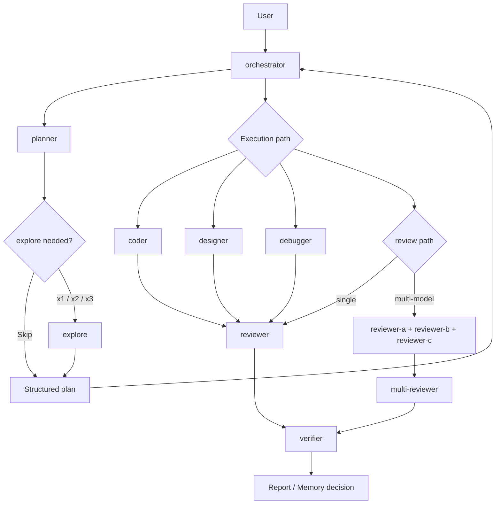
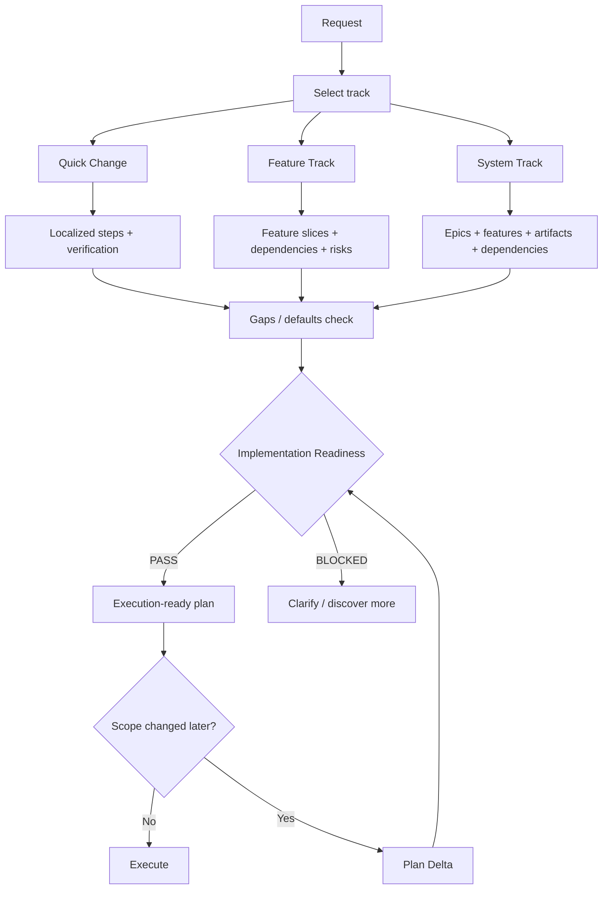
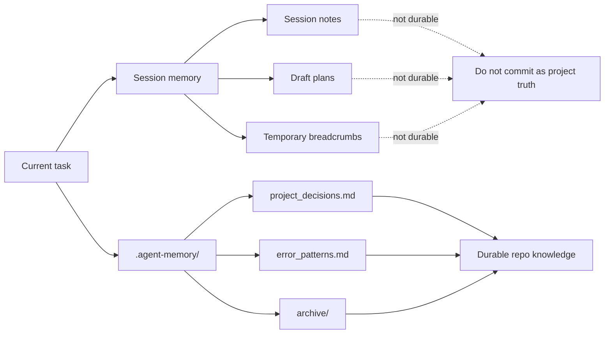

# Multi-Agent OpenCode Workflows

**Turn OpenCode into a disciplined multi-agent engineering system.**

This repo gives you a ready-to-adapt control plane for OpenCode agents:

- one user-facing orchestrator instead of agent chaos
- structured planning with tracks, epics, readiness gates, and plan deltas
- hidden specialist workers for coding, review, debugging, and discovery
- independent acceptance verification after review
- multi-model consensus review
- reusable internal skills instead of bloated prompts
- template-based durable memory that downstream projects can safely adopt

**Clone it, adapt it, and use it as a serious foundation for agentic delivery — not a demo prompt pack.**

## Pattern

This is a **supervisor-worker** multi-agent system, not a peer-to-peer hive.

- One **primary agent** (`orchestrator`) is user-facing — the main entrypoint.
- Thirteen **subagents** are invoked programmatically by the orchestrator via the Task tool.
- `planner` is a hidden subagent — invoked by orchestrator via Task tool for planning tasks.
- All other subagents are hidden and cannot call each other; flow is strictly hierarchical: orchestrator → {planner, coder, designer, debugger, explore, reviewer-a/b/c, multi-reviewer, verifier, improvement-analyst, improvement-evaluator}.

What this is **not**:
- Not a decentralized hive-mind. There is one control plane.
- Not peer-to-peer. Agents do not negotiate with each other.
- Not self-organizing. The orchestrator explicitly routes by task type and planning track.

What this **is**:
- A governed delegation tree with structured planning, independent review, and objective verification gates.
- Multi-model consensus for code review (`reviewer-a` + `reviewer-b` + `reviewer-c` → `multi-reviewer`).

---

Based on:

- [burkeholland gist](https://gist.github.com/burkeholland/0e68481f96e94bbb98134fa6efd00436)
- [simkeyur/vscode-agents](https://github.com/simkeyur/vscode-agents)
- [github/awesome-copilot](https://github.com/github/awesome-copilot)
- [AlexGladkov/claude-code-agents](https://github.com/AlexGladkov/claude-code-agents)
- [mrvladd-d/memobank](https://github.com/mrvladd-d/memobank)

## Quick Start

1. Clone this repo into your project or use it as a template.
2. Configure your model in `opencode.json` or set a global default:
   ```jsonc
   {
     "model": "opencode/claude-sonnet-4-6"
   }
   ```
   You can also set per-agent models using the `agent.<name>.model` key.
3. Run `opencode` in the project root.
4. The `orchestrator` agent is the default entrypoint. Planning tasks are routed to `planner` automatically by the orchestrator.
5. Internal agents (`explore`, `coder`, `designer`, etc.) are automatically invoked by the orchestrator — you don't need to call them directly.

### Agent models

By default, agents inherit the globally configured model. To assign different models per agent, add to `opencode.json`:

```jsonc
{
  "agent": {
    "planner": {
      "model": "opencode/claude-haiku-4-5"
    },
    "coder": {
      "model": "opencode/claude-sonnet-4-6"
    },
    "explore": {
      "model": "opencode/claude-haiku-4-5"
    }
  }
}
```

Run `opencode models` to see all available model IDs.

### Self-improvement quick start

For bounded self-improvement work, use the normal orchestrator flow and let it route to the hidden improvement roles when a task is about a candidate proposal or evaluation:

1. prepare a candidate proposal that only targets low-risk overlay assets under `.agents/skills/self-improvement-overlays/`
2. let the `improvement-analyst` review the proposal and produce a structured candidate description
3. let the `improvement-evaluator` score the candidate against safety, reliability, cost, reuse, and routing criteria
4. only promote when the evaluation passes and the policy allowlist still permits the target

This keeps the improvement loop explicit, reviewable, and fail-closed.

## Bounded self-improvement scaffold

This repository now includes a bounded self-improvement scaffold for safe, reviewable agent evolution.

It introduces:

- a hidden improvement analyst and evaluator for candidate proposal and independent scoring
- a low-risk overlay namespace for auto-mutable prompt/skill fragments
- policy, schema, scenario, and release manifests under [.agents/self-improvement](.agents/self-improvement)
- a validation and evaluation harness that can run locally without mutating protected control-plane files

The initial release is intentionally narrow: it only allows low-risk overlay changes and forbids automatic edits to routing, permissions, core agents, or governance policy.

## Repository Layout

```text
project_root/
├── .agent-memory/
│   ├── project_decisions.md
│   ├── error_patterns.md
│   └── archive/
├── .agents/
│   ├── skills/
│   │   ├── README.md
│   │   ├── review-core/           (reviewer logic, loaded by reviewer + reviewer-a/b/c)
│   │   ├── planning-structure/
│   │   ├── research-discovery/
│   │   ├── memory-management/
│   │   ├── code-quality/
│   │   ├── testing-qa/
│   │   ├── self-improvement-governance/
│   │   ├── self-improvement-evaluation/
│   │   └── self-improvement-overlays/
│   └── self-improvement/
│       ├── policy/
│       ├── schemas/
│       ├── scenarios/
│       ├── scripts/
│       └── reports/
├── .opencode/
│   ├── agents/
│   │   ├── orchestrator.md
│   │   ├── planner.md
│   │   ├── explore.md
│   │   ├── coder.md
│   │   ├── designer.md
│   │   ├── debugger.md
│   │   ├── verifier.md
│   │   ├── improvement-analyst.md
│   │   └── improvement-evaluator.md
│   └── skills -> ../.agents/skills/  (symlink)
├── opencode.json               (reviewer + reviewer-a/b/c + hidden improvement agents defined here)
└── README.md
```

## Agent Model

### Primary agent (user-facing)

| Agent | Description |
|-------|-------------|
| `orchestrator` | Main entrypoint for execution, routing, review, and completion control |

### Hidden subagents (invoked via Task tool by orchestrator)

| Agent | Defined in | Model | Permission |
|-------|------------|-------|------------|
| `explore` | agents/explore.md | (inherit) | edit: deny, bash: deny, read-only |
| `planner` | agents/planner.md | (inherit) | edit: deny, bash: deny, task: explore only |
| `coder` | agents/coder.md | (inherit) | edit: allow, bash: allow |
| `designer` | agents/designer.md | (inherit) | edit: allow, bash: allow, question: allow |
| `reviewer` | opencode.json | (inherit) | edit: deny, skill: allow |
| `reviewer-a` | opencode.json | `opencode/deepseek-v4-flash-free` | edit: deny, skill: allow |
| `reviewer-b` | opencode.json | `opencode/north-mini-code-free` | edit: deny, skill: allow |
| `reviewer-c` | opencode.json | `opencode/big-pickle` | edit: deny, skill: allow |
| `multi-reviewer` | agents/multi-reviewer.md | (inherit) | edit: deny, bash: deny |
| `debugger` | agents/debugger.md | (inherit) | edit: allow, bash: allow |
| `verifier` | agents/verifier.md | (inherit) | edit: deny, bash: allow |
| `improvement-analyst` | agents/improvement-analyst.md | (inherit) | edit: deny, bash: deny, read-only |
| `improvement-evaluator` | agents/improvement-evaluator.md | (inherit) | edit: deny, bash: deny, read-only |

All subagents are `hidden: true` — they don't appear in the `@` autocomplete. The orchestrator's task permissions use an explicit allowlist; only listed subagents can be invoked. The new improvement roles are read-only reviewers for candidate proposals and do not author changes directly.

## Self-improvement flow

The repository uses a bounded improvement loop rather than unrestricted self-editing:

1. **Proposal** — an improvement candidate is drafted against the allowlisted overlay surface only.
2. **Analysis** — `improvement-analyst` inspects the proposal and checks whether the target is within the safe boundary.
3. **Evaluation** — `improvement-evaluator` scores the candidate independently and returns a `PASS_AUTO`, `PASS_MANUAL`, or `BLOCKED` decision.
4. **Promotion** — a release record is created only if the candidate passes policy, schema, and safety gates.
5. **Rollback** — if a promotion later proves unsafe, the release can be rolled back to the baseline state.

Core routing, permissions, memory, and security policy remain protected and are not eligible for auto-modification.

## Control Plane

### Orchestrator

`orchestrator` is the sole control plane:

- never writes code directly
- performs only lightweight triage, routing, and governance
- delegates all file changes to coding/debug agents
- routes by task type and planning track
- decides when to use review, verification, debug, and worktrees
- enforces memory-write policy for durable outcomes

`orchestrator` is not a deep problem-framing agent:

- do not perform deep diagnosis, architecture design, or decomposition inside orchestrator
- do not resolve ambiguous intent beyond minimal routing triage
- escalate immediately to `planner` when the request has ambiguity, architectural choice, non-trivial decomposition, or unclear implementation readiness

It uses an explicit task permission allowlist rather than implicit agent fan-out.

### Planner

`planner` is the planning gatekeeper:

- clarifies ambiguous requests
- runs discovery directly or through `explore`
- selects one planning track:
  - `Quick Change`
  - `Feature Track`
  - `System Track`
- emits structured plans with:
  - objective
  - scope
  - epics or feature slices
  - dependencies
  - verification
  - gaps and defaults
  - implementation readiness
  - parallelization decision (when to use worktrees)

`planner` does not implement code.

### Explore

`explore` is a hidden read-only subagent used when discovery materially improves routing or planning.

Routing policy:

- `SKIP` when owner and file scope are already clear
- `AUTO x1` for one primary research track
- `PARALLEL x2` for two mostly independent research tracks
- `PARALLEL x3` only for larger multi-surface planning

### Verifier

`verifier` is a hidden non-authoring acceptance gate used after implementation and review.

It:

- runs objective checks such as tests, lint, typecheck, builds, and targeted smoke verification
- validates readiness using executed signals rather than code inspection
- returns `Verification Verdict: PASS` or `BLOCKED`
- stays independent from the coding/debugging agent that produced the patch

## Architecture Diagrams

### Control plane



## Planning Model

Planning follows explicit structure instead of ad hoc step lists.

### Tracks

- `Quick Change` — localized low-ambiguity work
- `Feature Track` — medium work with a few moving parts
- `System Track` — architecture, integration, or multi-surface work

### Required planning concepts

- `Clarification Status`
- `Planning Track`
- `Objective`
- `Scope`
- `Epics` or `Feature Slices`
- `Ordered implementation steps`
- `Verification`
- `Implementation Readiness`
- `Memory Update`
- `Parallelization Decision` (when to split work via git worktrees)
- `Gaps and Proposed Defaults`
- `Documentation Artifacts` for larger system work

### Readiness gate

Execution should not start unless the plan is ready:

- scope is stable enough
- affected areas are known
- dependencies are known
- verification is concrete
- critical gaps are resolved

If not, the plan must return `Implementation Readiness: BLOCKED`.

### Plan delta

If scope changes after a plan already exists, the preferred behavior is a `Plan Delta`:

- what changed
- what remains valid
- what steps are removed
- what new steps are added
- whether routing or readiness changed

### Planning flow



## Execution and Routing

### Default routing

- planning / ambiguity / architecture / decomposition → `planner`
- fast scouting → `explore`
- implementation → `coder`
- UI-only implementation → `designer`
- review / audit → `reviewer` or multi-review path
- reproducible failure → `debugger`
- acceptance verification → `verifier`

Routing rule:

- if the request is ambiguous, requires architectural judgment, needs decomposition, or is not implementation-ready, `orchestrator` must hand off to `planner` instead of framing the problem itself

### Review paths

- single review → `reviewer` (inherits caller's model, loads `review-core` skill)
- multi-review → `reviewer-a` + `reviewer-b` + `reviewer-c` in parallel (3 free Zen models), then `multi-reviewer` consolidates

### Acceptance verification

- after non-trivial implementation or verified bugfix, run independent review first
- after review and any follow-up fixes, run `verifier`
- close the task only after `verifier` passes, unless a justified skip rule applies

## Skills

Skills are stored in `.agents/skills/` and are exposed to OpenCode through the compatibility symlink `.opencode/skills`. The OpenCode `skill` tool loads them on demand.

For a catalog of available skills and when to use each one, see [`./.agents/skills/README.md`](.agents/skills/README.md).

Important skills:

- `review-core` — shared review contract; loaded by `reviewer` and `reviewer-a/b/c`
- `planning-structure` — planning tracks, epics, readiness gate, plan delta
- `research-discovery` — broad-to-narrow discovery
- `memory-management` — durable vs session memory rules
- `git-worktree` — filesystem isolation for parallel work
- `review-orchestration` — independent review gate, review routing, and optimization follow-up
- `multi-model-review` — consensus scoring, consolidation methodology
- `code-quality` — implementation/review heuristics
- `testing-qa` — validation rules
- `security-best-practices` — security review baseline
- `self-improvement-governance` — bounded self-improvement policy, allowlists, promotion gates, rollback rules
- `self-improvement-evaluation` — evaluation protocol and fail-closed decision rules
- `self-improvement-overlays/task-summary-reuse` — first low-risk overlay candidate for additive prompt/skill reuse
- `kotlin-backend-jpa-entity-mapping` — Kotlin + Spring Data JPA/Hibernate entity design
- `kotlin-tooling-agp9-migration` — KMP / Android Gradle Plugin 9+ migration guide

Imported Kotlin skills source:

- [Kotlin/kotlin-agent-skills](https://github.com/Kotlin/kotlin-agent-skills)

## Memory Model

The repository uses a two-layer memory model:

- durable memory in `.agent-memory/project_decisions.md` and `.agent-memory/error_patterns.md`
- session memory handled by opencode automatically

Rules:

- durable project knowledge goes only into `.agent-memory/`
- session notes, draft plans, and temporary breadcrumbs stay in opencode session memory
- draft epics, tentative feature breakdowns, and plan deltas are not durable by default

For this open-source repository, `.agent-memory/` is committed as a template:

- instructions and entry templates stay in git
- project-specific memory entries should be added only in downstream projects
- reusable template repos should keep these files empty except for guidance

### Memory model



## Worktrees and Parallel Work

Use git worktrees when parallel tasks require filesystem isolation, especially if overlapping files make normal parallel delegation unsafe.

Use worktrees when justified by the task:

- multiple independent subsystems
- high conflict risk in shared files
- high task volume
- strong need for environment isolation

The orchestrator owns worktree lifecycle (create/merge/cleanup); it delegates the actual terminal commands to `coder`.

## Conversion Notes

This repo was converted from the GitHub Copilot agent format to OpenCode. Key format changes:

| Copilot field | OpenCode equivalent |
|--------------|-------------------|
| `user-invocable: true` | `mode: primary` |
| `user-invocable: false` | `mode: subagent` + `hidden: true` |
| `disable-model-invocation: true` | `permission.task` allowlist in `opencode.json` |
| `target: vscode` | removed (not applicable) |
| `argument-hint` | removed (not supported) |
| `tools: [...]` | `permission: { edit:, bash:, ... }` |
| `agents: [...]` | `permission.task` in `opencode.json` |
| `vscode/memory` | opencode session memory (automatic) |
| `vscode/askQuestions` | `question` tool (`permission.question: allow`) |
| `.github/agents/` | `.opencode/agents/` + `opencode.json` |
| `.agent.md` extension | `.md` extension |

## Recommended Adoption

If you clone this repository into another project:

1. keep `.agent-memory/*.md` as templates initially
2. configure per-agent models in `opencode.json` (run `opencode models` for available IDs)
3. customize agent instructions for your repo structure and tooling
4. expose only the agents you want users to call directly
5. keep internal workers and skills hidden by default
6. tune planning tracks and review thresholds for your project size
7. swap the 3 free Zen models in `opencode.json` for any models you prefer

## References

- [OpenCode Documentation](https://opencode.ai/docs/)
- [OpenCode Agents](https://opencode.ai/docs/agents/)
- [OpenCode Agent Skills](https://opencode.ai/docs/skills/)
- [OpenCode Permissions](https://opencode.ai/docs/permissions/)
- [OpenCode Config](https://opencode.ai/docs/config/)
- [OpenCode Zen Models](https://opencode.ai/docs/zen/)